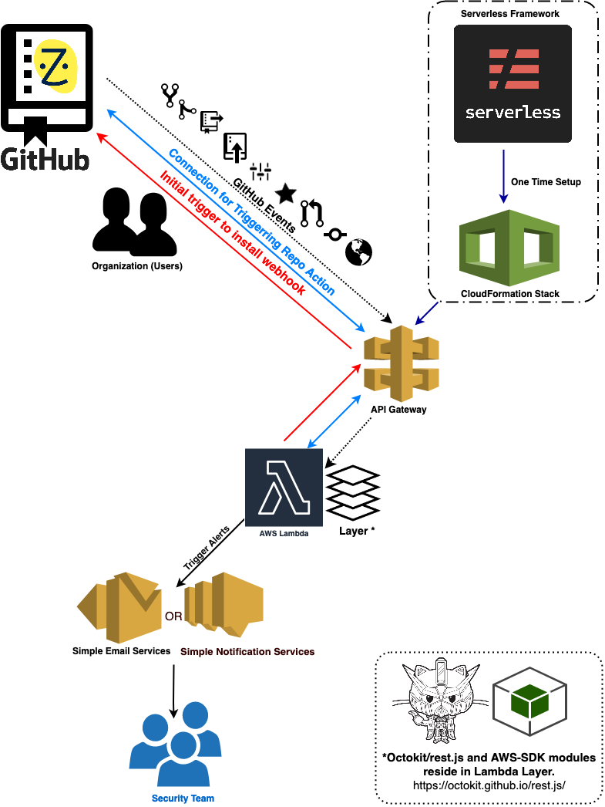

# GitHub Repository Automated Action
### Prior Running ```bash setup.sh```
Configure AWS CLI and Serverless Framework. And if you have separate AWS profile, please makesure you have it configure properly.
* Visit (https://docs.aws.amazon.com/cli/latest/userguide/cli-configure-profiles.html) for AWS CLI configuration.
* Visit (https://serverless.com/framework/docs/getting-started/) for serverless CLI configuration.

## To Do

1. Create AWS Simple Notification Services (SNS) topic in your AWS environment with topic name ``` github-repo-monitor ```. See https://docs.aws.amazon.com/gettingstarted/latest/deploy/creating-an-sns-topic.html.
2. If node_module folder is not present, unzip node_module.zip file to the same directory.
3. Assure you have ```AdministratorAccess``` in your AWS IAM role


## Usage

```$ bash setup.sh``` Enter the AWS Profile, AWS Region, GitHub Personal Access Token, and WebHook Secret

```$ sls deploy``` to rebuild stack

```$ sls remove``` to destory stack

## Description

Running ```bash setup.sh``` will perform the following execution:
1. Remove secrets.yml file.Create it if secret.yml not found. This file is created with AWS Account information and data you entered during setup process
2. Check for ```GitHub-Webhook``` alias in AWS KMS service. Create it if alias not found
3. Encrypt GitHub token and webhook secret
4. Stores the encrypted values in Amazon Systems Manager under "Store Parameter"
5. Deploy a Serverless Framework based on the information provided

## Workflow



## About

This project was released to the public as part of the Zocdoc's ZocSec.SecurityAsCode initiative.

The primary contributors to this effort are Jay Ball ([@veggiespam](https://github.com/veggiespam)) and Gary Tsai ([@garymalaysia](https://github.com/garymalaysia)).

Copyright © 2018-2019 Zocdoc Inc.  www.zocdoc.com

<!-- vim: spell expandtab
-->

