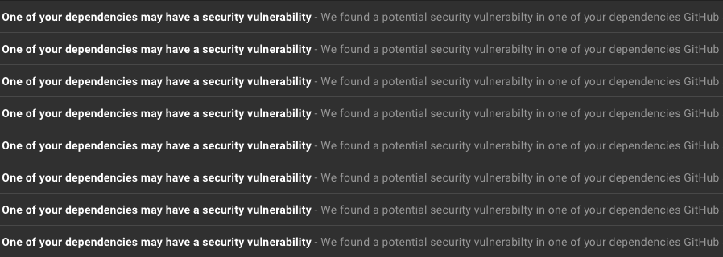

# Enable Vulnerability Scanning on All GitHub Repo

## Summary
Due to high demand on new endpoints to manage the vulnerability alerts setting for your repositories, GitHub released API for you to do just that [HERE](https://developer.github.com/changes/2019-04-24-vulnerability-alerts/).

This script is a Proof of Concept (PoC) for any to enable vulnerability scanning to all of their repos in organization.

*Note
You need be in Admin role for the repo or your organization

## Usage

```$ enable_vuln.py -t <Your Personal Access Token> -o <your company/organization>```

## Warning
You may introduce more work for your team and developers
