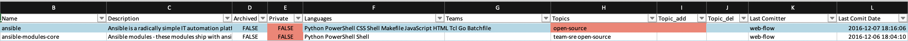

# Know_Your_RepOs (KYRO)

This script will output a XLSX file with all GitHub repo information to the present working directory.
The title of the file follows this naming convention: Github_Audit_YYYY-MM-DD.xlsx

## Usage

``` $ pip3 install -r requirement.txt ```

``` $ python3 kyro.py -t <YOUR TOKEN> -a``` to perform full account audit

``` $ python3 kyro.py -t <YOUR TOKEN> -u <updated of the orginal XLSX spreadsheet>``` to add or remove Topics from Repos

## Output Sample



## About

This project was released to the public as part of the Zocdoc's ZocSec.SecurityAsCode initiative.

The primary contributors to this effort are Jay Ball ([@veggiespam](https://github.com/veggiespam)) and Gary Tsai ([@garymalaysia](https://github.com/garymalaysia)).

Copyright © 2018-2019 Zocdoc Inc.  www.zocdoc.com

<!-- vim: spell expandtab
-->
